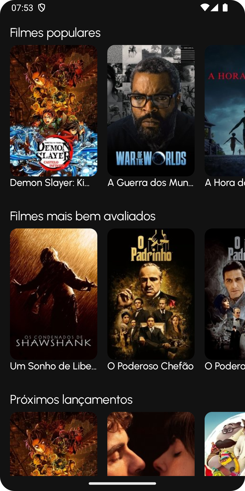
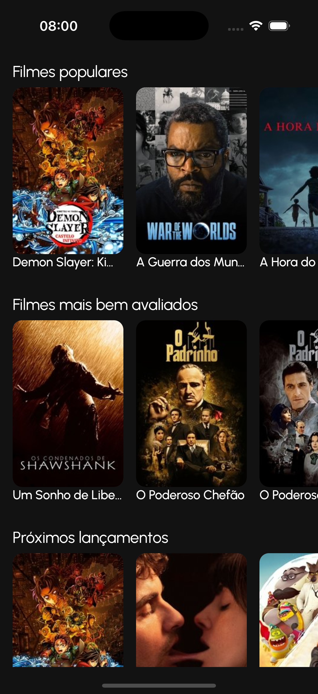

# KotlinMovie 🎬

Um aplicativo de catálogo de filmes desenvolvido com **Kotlin Multiplatform** que funciona nativamente no Android e iOS, compartilhando código e UI através do Compose Multiplatform.

## 📱 Screenshots

### Android
<div align="center">
  
  
</div>

### iOS
<div align="center">
  
  
</div>

## 🏗️ Arquitetura

O projeto segue os princípios da **Clean Architecture** com separação clara de responsabilidades:

```
composeApp/src/commonMain/kotlin/
├── data/                    # Camada de Dados
│   ├── mapper/             # Mappers para conversão de dados
│   ├── network/            # Cliente HTTP e modelos de rede
│   └── repository/         # Implementação dos repositórios
├── domain/                 # Camada de Domínio
│   └── model/              # Modelos de domínio
├── ui/                     # Camada de Apresentação
│   ├── components/         # Componentes reutilizáveis
│   ├── navigation/         # Navegação da aplicação
│   └── screen/            # Telas e ViewModels
├── design_system/          # Sistema de Design
│   ├── colors/            # Paleta de cores
│   ├── text_styles/       # Tipografia
│   └── theme/             # Tema da aplicação
├── di/                    # Injeção de Dependência
└── utils/                 # Utilitários
```

### Camadas da Arquitetura

- **UI Layer**: Compose Multiplatform com ViewModels e componentes reutilizáveis
- **Domain Layer**: Modelos de domínio e regras de negócio
- **Data Layer**: Repositórios, mappers e cliente de rede
- **DI Layer**: Configuração de injeção de dependência com Koin

## 🛠️ Tecnologias Utilizadas

### Core
- **Kotlin Multiplatform** - Compartilhamento de código entre plataformas
- **Compose Multiplatform** - UI declarativa compartilhada
- **Kotlin Coroutines** - Programação assíncrona

### Arquitetura & DI
- **Clean Architecture** - Separação de responsabilidades
- **MVVM Pattern** - Padrão de apresentação
- **Koin** - Injeção de dependência

### Networking
- **Ktor Client** - Cliente HTTP multiplataforma
- **Kotlinx Serialization** - Serialização JSON
- **OkHttp** (Android) / Darwin (iOS) - Engines HTTP

### UI & Design
- **Material 3** - Design system
- **Navigation Compose** - Navegação declarativa
- **Coil** - Carregamento de imagens
- **Font Awesome Icons** - Ícones

### Outras
- **Kotlinx DateTime** - Manipulação de datas
- **Gradle Version Catalog** - Gerenciamento de dependências

## 🚀 Como Executar

### Android
```bash
# macOS/Linux
./gradlew :composeApp:assembleDebug

# Windows
.\gradlew.bat :composeApp:assembleDebug
```

### iOS
1. Abra o projeto no Xcode: `iosApp/iosApp.xcodeproj`
2. Execute o projeto através do Xcode

## 📁 Estrutura do Projeto

- **`/composeApp`** - Código compartilhado entre Android e iOS
  - `commonMain` - Código comum para todas as plataformas
  - `androidMain` - Código específico do Android
  - `iosMain` - Código específico do iOS
- **`/iosApp`** - Aplicativo iOS nativo (SwiftUI)

## 🎯 Funcionalidades

- ✅ Lista de filmes populares
- ✅ Detalhes do filme selecionado
- ✅ Elenco e informações técnicas
- ✅ Interface responsiva e moderna
- ✅ Navegação fluida entre telas
- ✅ Carregamento de imagens otimizado

---
